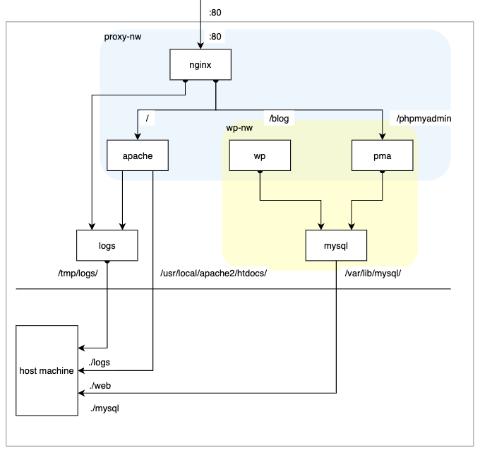

# sample docker infrastructure w/o docker-compose

This is a sample docker infrastructure created by Dockerfile and some docker commands.  
For learning some docker commands and the network specifications.  
That's why this repository does not have docker-copose.yml .

## infrastructure

The infrastructure is created as follow:

* nginx container
    * work as reverse proxy
* apache container
    * work as static page when accessed as `localhost/`
    * mount the document root into host machine's dirctory
    * connect it into `logs container`, which is data volume container, to export its access_log
    * belong to `proxy-nw`
* pma container
    * work as phpMyAdmin when accessed as `localhost/phpmyadmin`
    * refer to the `mysql container`
    * belong to `proxy-nw` and `wp-nw`
* mysql container
    * work as MySQL server
    * mount its data into host machine's dirctory
    * belong to `wp-nw`
* logs container
    * work as data volume container which is mounted to `/tmp/logs` on the hyperkit
